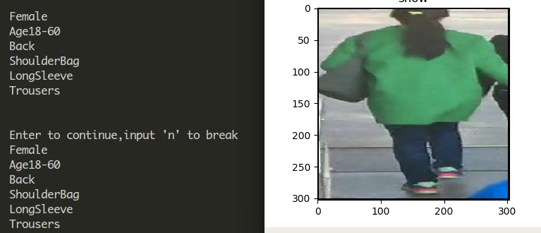

# Hydraplus_Net

an re-implementation of HydraPlus Net based on Pytorch.  
MNet uses Inception_v3.  
## example  
    
## requirement  
pytorch  
visdom  
CUDA 8.0  
## dataset  
PA-100K dataset  

|--Hydraplus  
|----data  
|------PA-100K  
|--------annotation  
|--------ralease_data  
|----------release_data  

## 1.train  

### 1.train init weights  
    python train.py -m {AF1|AF2|AF3|HP|MNet} [-mpath  MNet_weight] \
    [-af1path AF1_weight -af2path AF2_weight -af3path AF3_weight]   
#### example:  
    python train.py -m AF1 -mpath MNet/checkpoint_epoch_0  
### 2. fine-tuning existing checkpoints  
    python train.py -m {AF1|AF2|AF3|HP|MNet}  -p checkpointpath  
#### example:  
    python train.py -m AF1 -p AF1/checkpoint_epoch_0  
## 2.test  
    python test.py -m {AF1|AF2|AF3|HP|MNet} -p checkpointpath  
#### example:  
    python test.py -m AF1 -p AF1/checkpoint_epoch_0  
## 3.show  
    python show.py -m {AF1|AF2|AF3|HP|MNet} -p checkpointpath  
#### example:  
    python show.py -m AF1 -p AF1/checkpoint_epoch_0  
